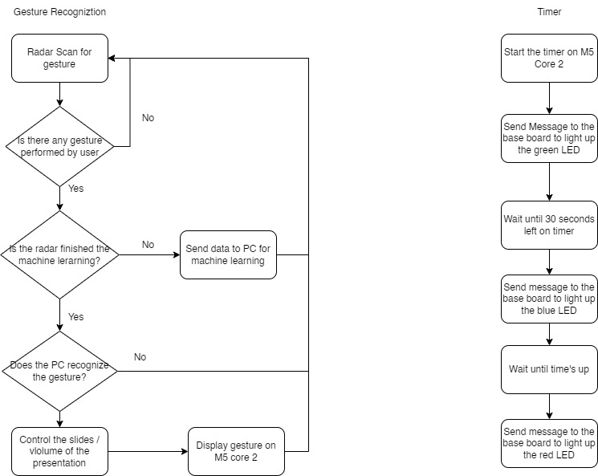
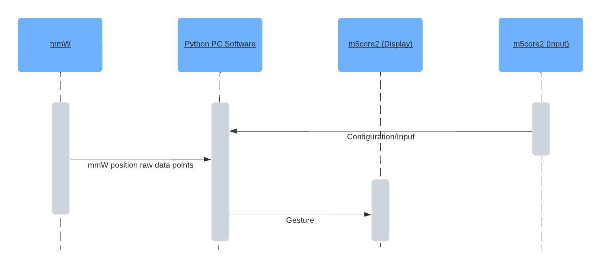
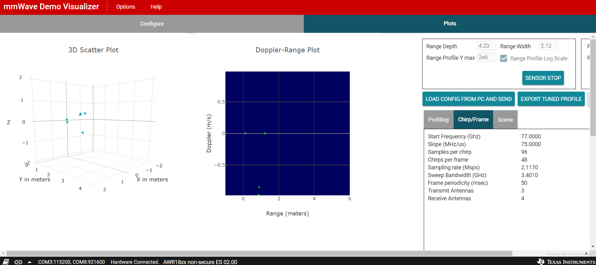
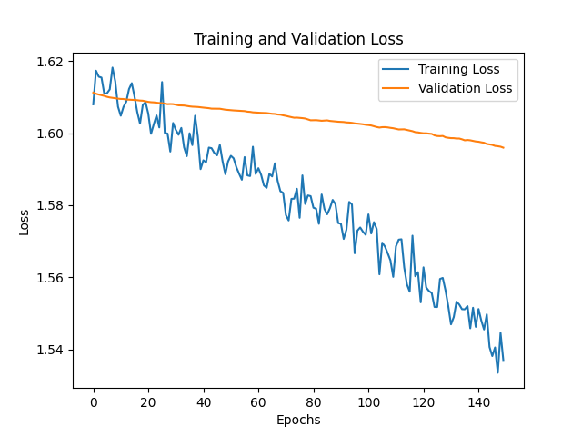
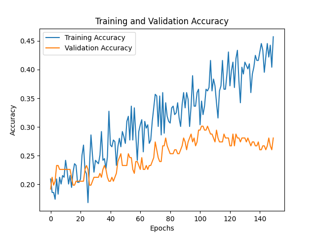
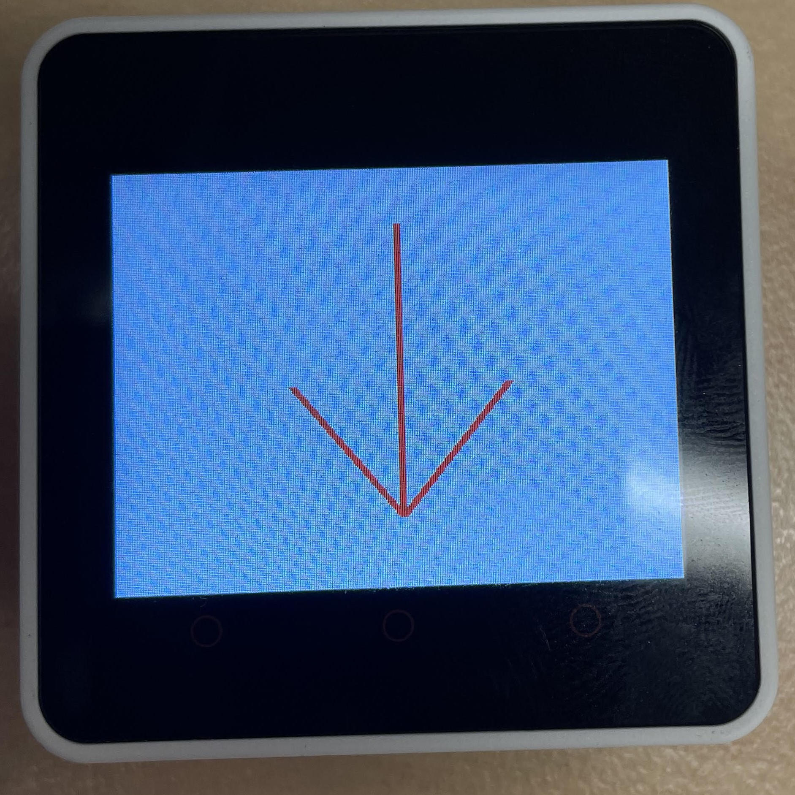
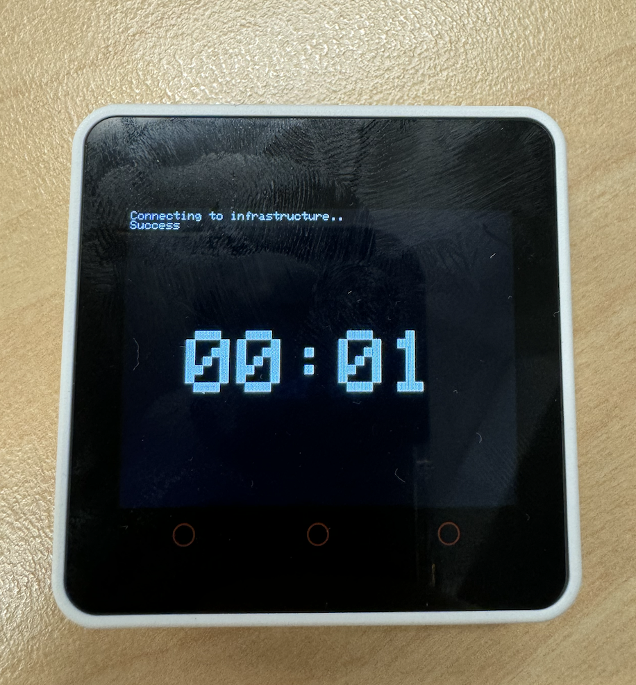
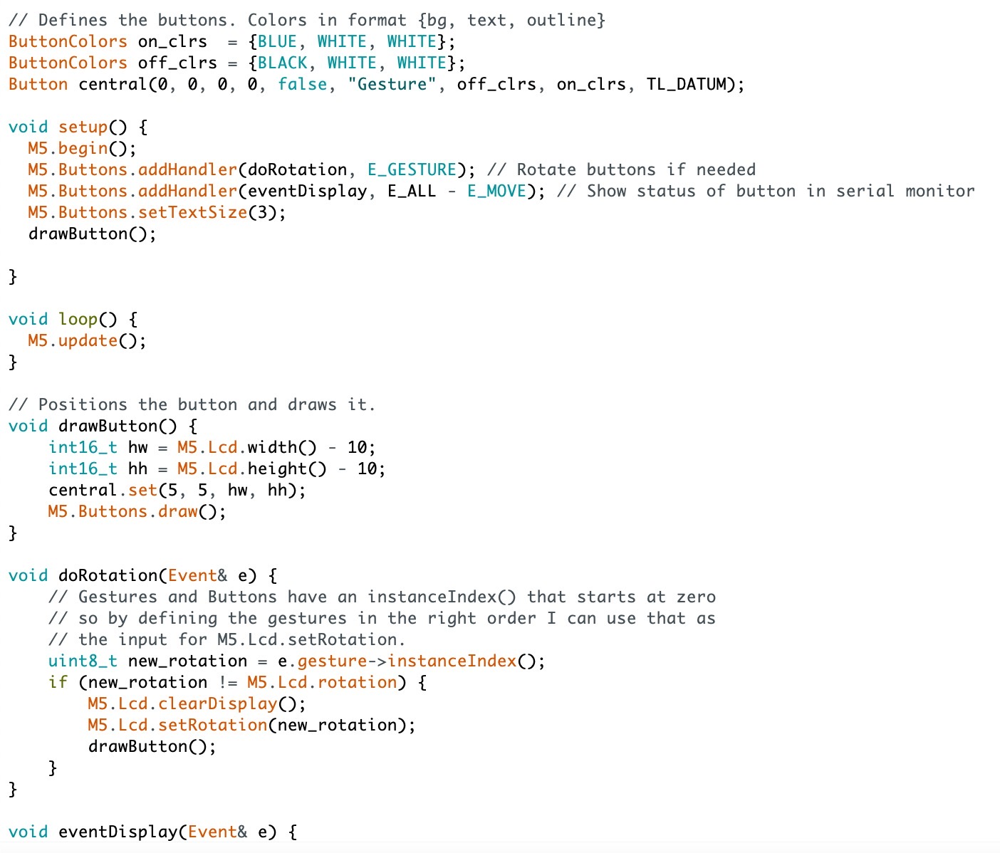
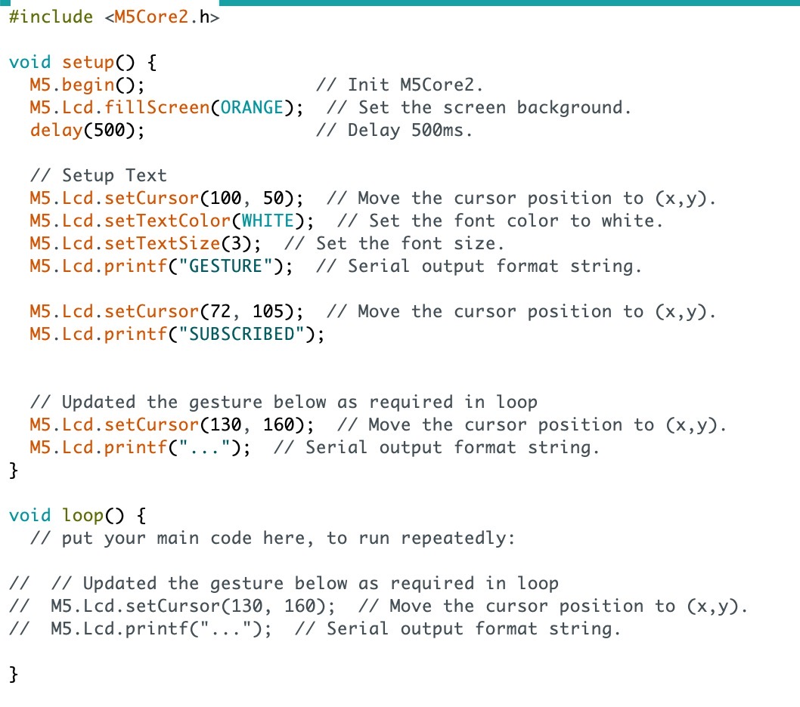
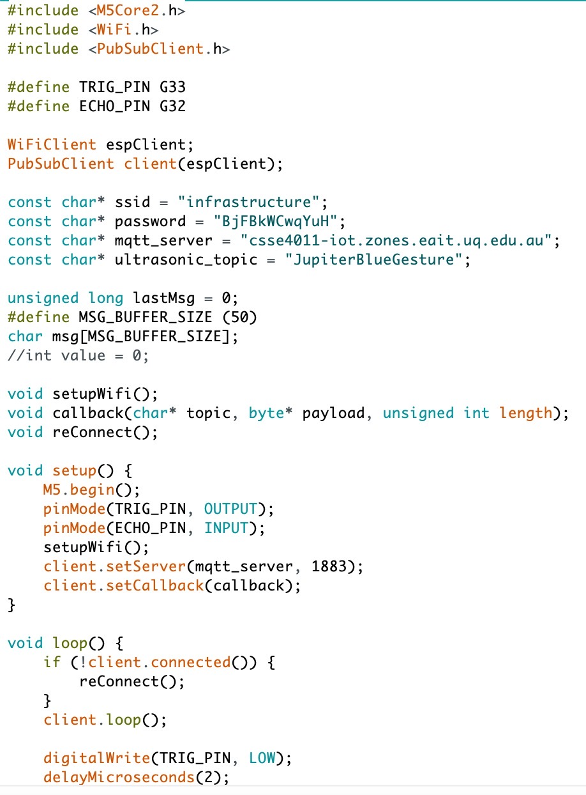

# Jupiter - Blue Wiki
## Team Member List and Roles
Tsz Chung Mak - mmW Radar Implementation & capturing the data from radar  
Jayden Situ - M5Core2 Communication  
Michael Guarrera - Machine Learning Algorithm  
Thuan Pham - Machine Learning Algorithm
## Project Overview
The mmW Radar is used to receognize gesture and perform actions with HID interface which can controls the slides and volume of video during presentation. A M5 core 2 will be used to display the gesture performed by the user. Another M5 Core 2 is used as a timer which assist uper during presentation.
### Performance Indicator:
In order to assess the performance of the project, 5 key indicators are used:
- Accuracy of mmW Radar reading: It is about how accurate can the mmW capture the gesture perform by the user. Whatever gesture is perform in
front of radar, it should be captured accurately for later recognition.
- Accuracy of gesture recognition: The radar should be able to identifiy all the predefined gestures for HID interface and also able to exclude all 
other unkown gestures.
- Accuracy in receive HID protocol from PC: Can the HID protocol get executed properly based on the performed gestures.
- Data transmission rate: How fast the HID protocol being executed after a gesture is perfromed.
- M5Core2 ables to configurate and display gesture captured in reasonable manner: The gesture displayed on the M5 Core 2 should be readable and clear to understand
### System Overview
#### Hardware Architecture

#### Top-level Flow Chart of Software IMplementation

### Sensor Integration
#### Sensor
The A111/AWR1843 mmW Radar will be used for the senor in this project. The Radar is mainly used for capturing gesture. 
#### Types of Data
The radar can capture different types of data which
can be used to deteremine different kinds of gesture. To begin, it capture the distance between the sensor and the gesture. It will emit a pulse and count the time it takes for it to
echo back to the radar. It can help the sensor to track down the movement of the hand over time and identify the gesture. Second, it will capture the velocity that is performed by the
change of the gesture. It can help the radar to detect the change of gesture and help identifying the gesture. Finally, it can capture the the micro-doppler signature which can be used
to determine the information about small-scale motion. It can tell the structure of the gesture and the motion pattern of it. It is typically used for machine learning to recognize
the gesture.
The most important data for gesture recognition is the Doppler and range data. It can allow us to identify the valid data points and recognize pattern accordingly.
#### Sensor Integration
The radar will be placed in front of the PC which is for the HID interface. The radar will connect to the PC directly. Whenever a gesture is performed in front of the radar the radar will capture the data and send them to PC. At the beginning, all the data will be used for machine learning.
After the learning process is finished, the sensor data will be used to recognize gesture. After the gesture is recognized, action will be performed in the HID interface correspondingly. It will be used to perform action for presentation.
### Wireless Network Communication
#### Network Topology and IoT Protocols:
- MQTT (Message Queuing Telemetry Transport): Used for communication between the M5core2 device and the NRF52840_DK board. MQTT is a lightweight and efficient protocol for IoT communication, ideal for low-power devices and scenarios where bandwidth is limited.
- Serial Communication: Employed to connect the NRF52840_DK board to the PC software running Python for machine learning. Serial communication provides a reliable and straightforward way to transfer data between devices over a physical connection.
#### Data Rate Requirement:
Given the real-time or near real-time nature of gesture recognition, the data rate required for communication should be capable of handling multiple gestures per second. The specific data rate will depend on factors such as the complexity of gestures, the frequency of updates, and the precision required for gesture recognition.
MQTT is generally efficient and can handle moderate data rates effectively. Serial communication between the Nucleo-L496ZG board and the PC is typically fast enough to support real-time data transfer for gesture recognition applications.
#### Message Protocol Diagram

### Algorithms for Machine Learning
The goal of the project is for the system to accurately unpack the data collected from mmW Radar, hence correctly identifying the hand gestures from the data received. The potential issue of this is since hand movement can be either exagerated of micro due to human incosistency, it is difficult to determine the correct parameters and constants used for the recognition algorithm. 
This is where machine learning come in, by using machine learning, we hope to train the AI to adapt to inconsistency in human behaviour and correctly identify hand gesture without relying on pre-determined parameters. 
To train the data, a PC camera will be used in the process, the purpose of the camera is to create a dynamic training set for our hand gesture algorithm to train from. Using this method instead of a fix training set avoid overfitting the model and consequently lack of the flexibility and cannot adapt to human inconsistency as mentioned. 
The PC camera hand gesture recognition will use Google Mediapipe as a starting point [1], this will be more accurate since the library have successful predecessor example. Than the gesture regconised by the camera will then be compared by the gesture recognised by our algorithm, which then our algorithm will learn from the error (if any) and train it self.  
At the moment, the machine learning method considering is using neural network, and the programming language will use Python, which already exist library for Google Mediapipe and neural network algorithm.

### DIKW Pyramid Abstration
#### Data:
Raw data obtained from the mmW Radar includes distance measurements, capturing the positions and movements of hands and arms. This data includes numeric values representing distances between the radar and various parts of the body.
#### Information:
Processed data that has been transformed into meaningful information. This stage involves converting raw distance measurements into spatial gestures, identifying patterns such as hand movements, gestures, and their corresponding distances.
#### Knowledge:
Involves the application of machine learning algorithms to analyze the information gathered from the radar. This includes training the ML model to recognize specific hand gestures based on the patterns identified in the information stage. The model learns to associate certain distance measurements and movements with predefined gestures like mouse movements or keyboard inputs.
#### Wisdom:
The highest level of understanding derived from the knowledge gained. At this stage, the system is capable of accurately recognizing a wide range of gestures using mmW Radar data. It can translate these gestures into actions on a computer, such as controlling the mouse cursor or simulating keyboard inputs. Additionally, the system can display the recognized gestures as icons on the M5core2 device, providing real-time feedback to the user.
## Equipment
- M5Core2 x 2
- Nucleo-L496ZG
- mmW Radar (AWR1843)
- PC Interface
## Progress
- Finish configuring the radar for gesture recognition (3/5/2024)

- Start trying the machine learning with the radar and develop the AI model (7/5/2024)
- Start coding the M5 Core 2 for timer purpose (10/5/2024)
- implement the first method of capturing the data from the mmW radar (14/5/2024)
- test the first method with AI model (16/5/2024)
- develop a second method to capture the data from the mmW radar (16/5/2024)
- test the second method with AI model (17/5/2024)
- Improved AI model with data normalisation, splitting the data into a training set and a validation set with a 70/30 split. Also normalised the amount of each possible output so that it wouldn't be biased towards the more common ones. Before this average validation of 25%, after making all classes proportional accuracy dropped to 20%, which is same as randomly guessing. After AI improvements accuracy increased to around 30%. (17/5/2024)

- develop and implement the gesture recoginizion on the second M5 Core 2 (17/5/2024)

- Develop and tested timer on M5Core2 (17/5/2024)

- develop and implement the LED with the M5 core 2 timer (18/5/2024)
- Final testing on all aspects of the project (19/5/2024)

### Publish Gesture

### Subcribe Gesture

 

### MQTT Communication

## Reference
[1]: https://developers.google.com/mediapipe/solutions/vision/gesture_recognizer
