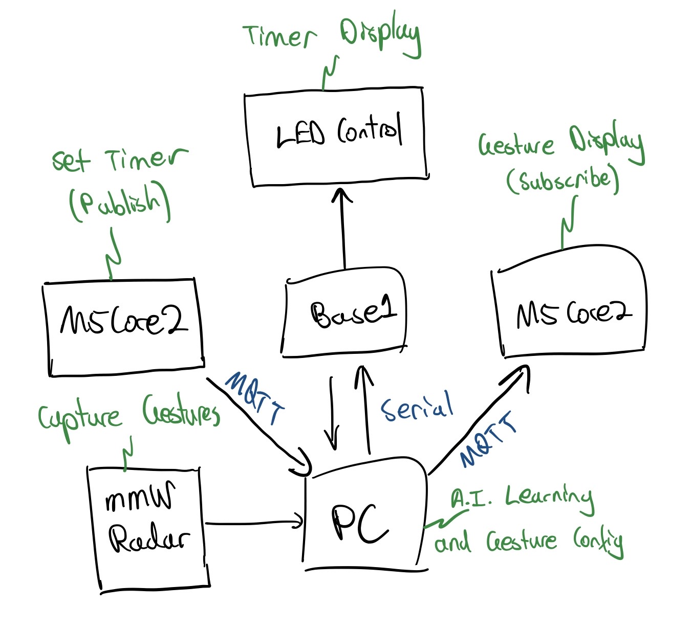

# Jupiter - Blue Wiki
## Team Member List and Roles
Tsz Chung Mak - mmW Radar Implementation  
Jayden Situ - M5Core2 Communication  
Michael Guarrera - Machine Learning Algorithm  
Thuan Pham - Machine Learning Algorithm
## Project Overview
Use mmW Radar to determine hand gestures to control HID as a mouse to interact with PC interface
### Performance Indicator:
In order to assess the performance of the project, 5 key indicators are used:
- Accuracy of mmW Radar reading
- Accuracy of gesture recognition
- Accuracy in receive HID protocol from PC
- Data transmission rate
- M5Core2 ables to configurate and display gesture captured in reasonable manner
### System Overview
#### Hardware Architecture

#### Top-level Flow Chart of Software IMplementation
### Sensor Integration
#### Sensor
The A111/AWR1843 mmW Radar will be used for the senor in this project. The Radar is mainly used for capturing gesture. 
#### Types of Data
The radar can capture different types of data which
can be used to deteremine different kinds of gesture. To begin, it capture the distance between the sensor and the gesture. It will emit a pulse and count the time it takes for it to
echo back to the radar. It can help the sensor to track down the movement of the hand over time and identify the gesture. Second, it will capture the velocity that is performed by the
change of the gesture. It can help the radar to detect the change of gesture and help identifying the gesture. Finally, it can capture the the micro-doppler signature which can be used
to determine the information about small-scale motion. It can tell the structure of the gesture and the motion pattern of it. It is typically used for machine learning to recognize
the gesture.
#### Sensor Integration
The radar will be placed in front of the PC which is for the HID interface. The radar will connect to the PC directly. Whenever a gesture is performed in front of the radar and 
the button from one of the M5 Core 2 is pressed, the radar will capture all the previous data and send them to PC. At the beginning, all the data will be used for machine learning.
After the learning process is finished, the sensor data will be used to recognize gesture. After the gesture is recognized, action will be performed in the HID interface correspondingly.
### Wireless Network Communication
### Algorithms for Machine Learning
The goal of the project is for the system to accurately unpack the data collected from mmW Radar, hence correctly identifying the hand gestures from the data received. The potential issue of this is since hand movement can be either exagerated of micro due to human incosistency, it is difficult to determine the correct parameters and constants used for the recognition algorithm.
This is where machine learning come in, by using machine learning, we hope to train the AI to adapt to inconsistency in human behaviour and correctly identify hand gesture without relying on pre-determined parameters.
To train the data, a PC camera will be used in the process, the purpose of the camera is to create a dynamic training set for our hand gesture algorithm to train from. Using this method instead of a fix training set avoid overfitting the model and consequently lack of the flexibility and cannot adapt to human inconsistency as mentioned.
The PC camera hand gesture recognition will use Google Mediapipe as a starting point [1], this will be more accurate since the library have successful predecessor example. Than the gesture regconised by the camera will then be compared by the gesture recognised by our algorithm, which then our algorithm will learn from the error (if any) and train it self. 
At the moment, the machine learning method considering is using neural network, and the programming language will use Python, which already exist library for Google Mediapipe and neural network algorithm.

### DIKW Pyramid Abstration
## Equipment
- M5Core2 x 2
- NRF52840 DK
- mmW Radar
- PC Interface
## Progress
## Reference
[1]: https://developers.google.com/mediapipe/solutions/vision/gesture_recognizer